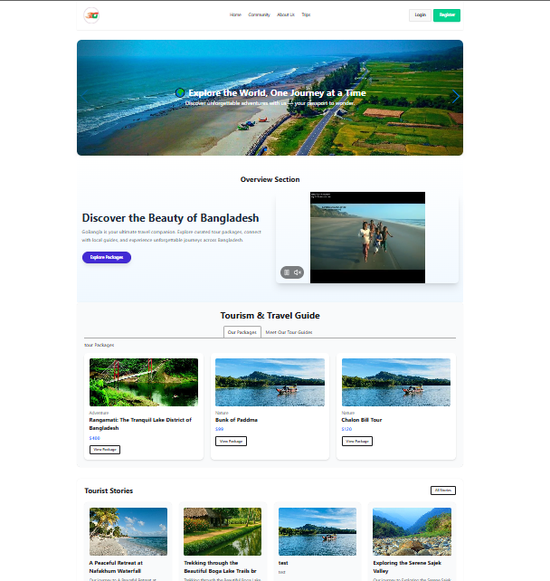

# 🌍 GoBangla Travel Guide 🧳

A full-stack travel and tourism web application built with **MERN Stack**, enabling users to explore curated travel packages, meet expert tour guides, and book memorable adventures — all through a modern, responsive UI.

---

## 🌐 Live Site

🔗 https://gobangla-fc335.web.app/ 

admin: admin@gmail.com
pass: asdfg123

---

## ✨ Features

- 🔐 **Google Authentication** (Firebase)
- 🧑‍🤝‍🧑 **User Roles**: Admin, Guide, User
- 📦 **Tour Packages**: Add, edit, delete with gallery and FAQs
- 📸 **Image Uploads**: With preview and removal
- 🎯 **Tour Booking System** with status management
- 👨‍💼 **Tour Guide Profiles** with assigned tours
- 🔎 **Search & Filters** on packages and users
- 📅 **Tour Plan View**: See trip breakdown by day
- 💳 **Payment Integration** (Stripe)
- 🛡️ **Protected Routes & Access Control**
- ✅ Toast notifications and confirmation modals
- 📱 Fully responsive (Tailwind CSS + DaisyUI)

---

## 🧑‍💻 Tech Stack

| Frontend        | Backend         | Database     | Tools & Auth     |
|-----------------|------------------|--------------|------------------|
| React.js        | Express.js       | MongoDB      | Firebase Auth    |
| Tailwind CSS    | Node.js          | MongoDB Atlas| Stripe API       |
| DaisyUI         | REST APIs        |              | React Hook Form  |
| React Router    |                  |              | React Toastify   |

---

## 📸 Screenshots

---

---

## 👨‍🔧 Author

**Nayan Islam**  
💼 MERN Stack & Laravel Developer  
📧 [nayanislam085@gmail.com](mailto:nayanislam085@gmail.com)

